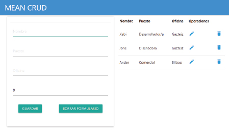
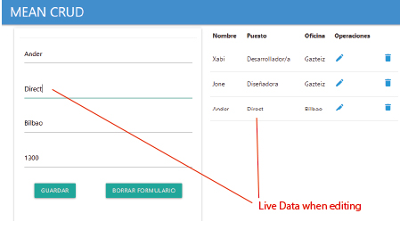

# Frontend

This project is a part of the MEAN stack CRUD practice that I have done. The other part is in another repository called mean_test_backend.
To run it locally, download both parts. 
- Run      /mongod
- Run developer server in angular folder      /ng serve   http://localhost:4200/
- Run in the server folder      /npm run dev

This project was generated with [Angular CLI](https://github.com/angular/angular-cli) version 9.1.7.

